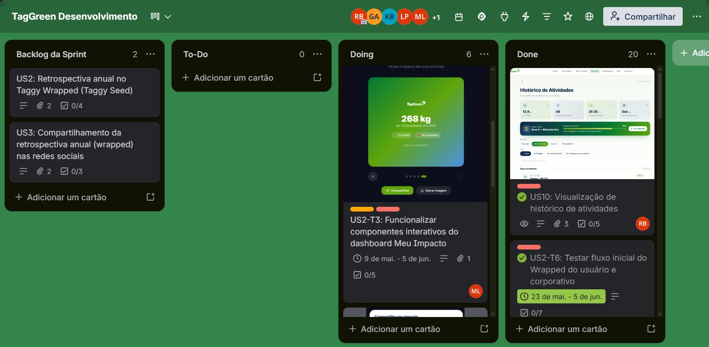

# 

---

## 📌 Sobre o TagGreen

O projeto **TagGreen** tem como objetivo desenvolver uma solução que permita calcular e comunicar o impacto ambiental evitado pelos usuários ao utilizarem pagamentos automáticos em pedágios e estacionamentos. A proposta é criar uma calculadora que estime a redução de emissões de carbono e consumo de papel, tornando esses dados mais visíveis e compreensíveis para os clientes.

---
## 🎥 Evidência Funcionalidades Projeto

  

---
## 🎥 Vídeo Demonstrativo Protótipo

  

---
## 🎨 Protótipos

  

---
## 📋 Trello

  

  

## Contribuindo para o TagGreen 🌱
Obrigado por considerar contribuir com o projeto TagGreen! Este documento explica como configurar o ambiente, seguir boas práticas e enviar suas contribuições.

### 🚀 Configuração do Ambiente
Clone o repositório

bash
git clone https://github.com/gga-cesarschool/Taggy-Projetos-2-Grupo-3.git
cd Taggy-Projetos-2-Grupo-3
Crie e ative um ambiente virtual Python

bash
python -m venv venv
source venv/bin/activate   # Linux/Mac
venv\Scripts\activate      # Windows
Instale as dependências

### Python:

bash
pip install -r requirements.txt
Node.js:

bash
npm install
Rodando o projeto

### Com Node.js:

bash
npm run dev
Diretamente com Django:

bash
python manage.py runserver

### 📂 Estrutura do Projeto
taggy/ → Configurações principais do Django

home/ → Aplicação principal

templates/ → Templates HTML

static/scss/ → Estilos SCSS

requirements.txt → Dependências Python

package.json → Dependências Node.js

### 📝 Boas Práticas
Branching: Crie uma branch para cada feature ou correção (feature/nome-da-feature, fix/nome-do-bug).

Commits: Use mensagens claras e no imperativo (ex: "Adiciona cálculo de emissões").

Pull Requests: Sempre descreva o que foi alterado e o motivo.

Código: Siga o padrão PEP8 para Python e mantenha consistência no estilo JavaScript/SCSS.

### ✅ Fluxo de Contribuição
Faça um fork do repositório.

Crie uma branch para sua contribuição.

Implemente e teste suas alterações.

Envie um Pull Request descrevendo claramente as mudanças.

Aguarde revisão e feedback da equipe.

### Contato
Em caso de dúvidas, entre em contato com os integrantes pelo e-mail listado no README (github.com in Bing).

## Programação em Par 
Durante esta etapa do projeto, dedicamos aproximadamente 4 horas à implementação da retrospectiva Taggy Seeds. Conseguimos concluir a funcionalidade na área de Pessoa Física, validando a exibição dos dados e o fluxo da retrospectiva.

Na área de Pessoa Jurídica, a implementação não foi finalizada devido à ausência de alguns dados necessários para compor a retrospectiva completa. Ainda assim, o processo foi importante para entendermos melhor a estrutura dos dados da plataforma, a lógica de integração e os desafios técnicos envolvidos.

A atividade proporcionou aprendizado relevante sobre o funcionamento do sistema e deixou identificados os ajustes necessários para concluir a retrospectiva na área empresarial em uma próxima etapa.

### 🌟 Reflexões sobre Programação em Par
Aprendizado mútuo  
Cada integrante contribui com seus conhecimentos e aprende com o outro. Isso acelera a compreensão de conceitos e evita que erros passem despercebidos.

- Complementaridade  
Enquanto uma pessoa cria o banco de dados e estrutura as tabelas, a outra valida os tipos e integra no Django. Essa complementaridade garante que o trabalho seja mais completo e consistente.

- Feedback imediato  
Trabalhar lado a lado permite identificar problemas rapidamente e corrigi-los antes que se tornem grandes obstáculos.

- Colaboração e confiança  
A prática fortalece o espírito de equipe, já que cada um depende do outro para avançar. Isso gera confiança e responsabilidade compartilhada.

- Motivação e engajamento  
Dividir desafios torna o processo mais leve e motivador. Um apoia o outro, e juntos mantêm o ritmo de desenvolvimento.
Esse tipo de reflexão mostra que o projeto não é apenas sobre código, mas também sobre crescimento coletivo.

---

## 👥 Integrantes
- **Guilherme Gomes Andrade**  
  📧 gga2@cesar.school  

- **Karollyne Santos Barbosa**  
  📧 ksb@cesar.school  

- **Lisa Sales Penides**  
  📧 lsp2@cesar.school  

- **Maria Clara Bello Pereira Lopes**  
  📧 mcbpl@cesar.school  

- **Rafael Lucas Viana da Silva**  
  📧 rlvs@cesar.school  

- **Rhayssa Santos Barbosa**  
  📧 rsb6@cesar.school  

---

## 👥 Papéis
- **Product Owner (P.O):** Maria Clara  
- **Scrum Master:** Lisa  
- **Back-End:** Rafael e Guilherme  
- **Front-End:** Rhayssa  
