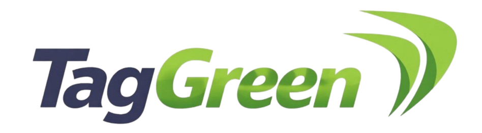
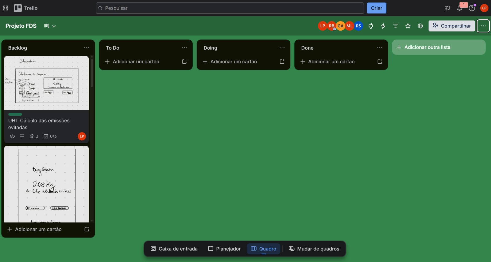

# 

---

## 📌 Sobre o TagGreen

O projeto **TagGreen** tem como objetivo desenvolver uma solução que permita calcular e comunicar o impacto ambiental evitado pelos usuários ao utilizarem pagamentos automáticos em pedágios e estacionamentos. A proposta é criar uma calculadora que estime a redução de emissões de carbono e consumo de papel, tornando esses dados mais visíveis e compreensíveis para os clientes.

---
## 🎥 Vídeo Demonstrativo

  

---
## 🎨 Protótipos

  

---
## 📋 Trello

  

  

---

## 👥 Integrantes
- **Guilherme Gomes Andrade**  
  📧 gga2@cesar.school  

- **Karollyne Santos Barbosa**  
  📧 ksb@cesar.school  

- **Lisa Sales Penides**  
  📧 lsp2@cesar.school  

- **Maria Clara Bello Pereira Lopes**  
  📧 mcbpl@cesar.school  

- **Rafael Lucas Viana da Silva**  
  📧 rlvs@cesar.school  

- **Rhayssa Santos Barbosa**  
  📧 rsb6@cesar.school  

---

## 👥 Papéis
- **Product Owner (P.O):** Maria Clara  
- **Scrum Master:** Lisa  
- **Back-End:** Rafael e Guilherme  
- **Front-End:** Rhayssa  